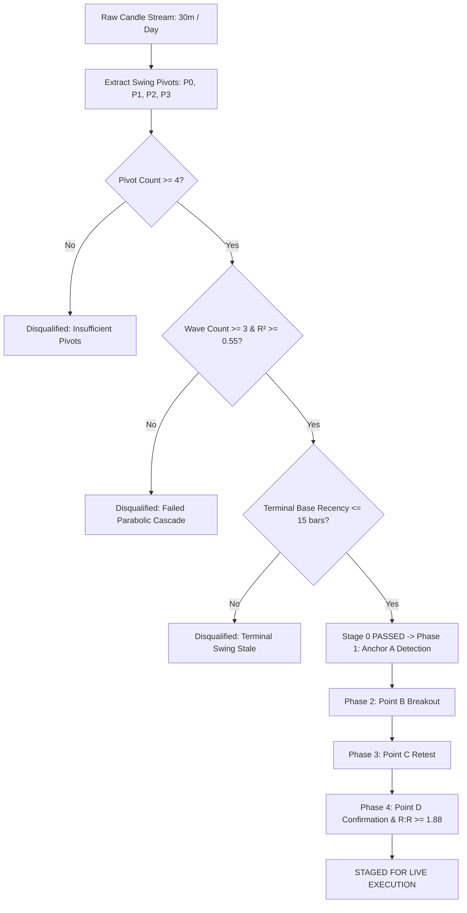

# Stage 0 Parabolic Cascade Filter — Technical Reference & Strategy Guide

**Document Version**: 1.0.0  
**Author**: Price Action & Derivatives Engineering  
**System**: Price Action Trading System (Zerodha Kite)  
**Target Audience**: Strategy Developers, Discretionary Traders & Automated Engines  

---

## Executive Summary

The **Stage 0 Parabolic Cascade Filter** is a pre-execution market structure gatekeeper designed to identify **institutional multi-wave exhaustion** before validating **Anchor (A-Formation)** and **A-B-C-D Breakout Cycles**.

While the filter provides exceptional trade quality and asymmetric Risk-to-Reward ($R:R > 8:1$), strict static constraints ($\ge 3$ waves on a single timeframe) can create blind spots in fast-trending, 2-wave consolidation, or V-reversal market environments.

This document outlines the mathematical foundation, candlestick mechanics, empirical trade audits, real-world limitations, and actionable architectural enhancements.

---

## 1. Mathematical & Structural Foundation

### 1.1 The Parabolic Exhaustion Model

In institutional order flow, true trend exhausts do not occur linearly; they form decaying polynomial curves as liquidity dries up:

$$\text{Curve Model: } y = ax^2 + bx + c$$

* **Bullish Bottom Exhaustion (Dome $\cap$)**: 
  - Defined by Highs & Closes ($y = \frac{\text{High} + \text{Close}}{2}$).
  - Requires negative curvature coefficient: $a < 0$.
* **Bearish Top Exhaustion (Cup $\cup$)**: 
  - Defined by Lows & Closes ($y = \frac{\text{Low} + \text{Close}}{2}$).
  - Requires positive curvature coefficient: $a > 0$.
* **Goodness of Fit ($R^2$)**:
  - $R^2 = 1 - \frac{SS_{\text{res}}}{SS_{\text{tot}}} \ge 0.55$ (quantifies how cleanly price action adheres to the parabolic arch).

```
                 STAGE 0 MULTI-WAVE PARABOLIC CASCADE
 
        [Wave 1 Parabolic Arch]       [Wave 2 Arch]       [Wave 3 Arch]
            (R² ≥ 0.55)                (R² ≥ 0.55)         (R² ≥ 0.55)
          ╭──────────────╮           ╭───────────╮       ╭───────────╮
         P0              P1         P1           P2     P2           P3 (Terminal Base)
                                                                      └───> Anchor A Allowed
```

---

### 1.2 Pipeline Execution Hierarchy



---

## 2. Real-World Case Study: `BAJAJFINSV26AUG2100PE`

On **August 3, 2026**, the system captured a textbook execution on the 30-minute timeframe:

| Metric | Value | Technical Context |
| :--- | :--- | :--- |
| **Pattern** | `BASE_ABCD` | 4-Stage Base Breakout |
| **Entry Price** | **₹55.15** | Point D 30-minute confirmation close |
| **Stop Loss (SL)** | **₹47.48** | Buffered below Anchor A low ($48.45 - 0.97$) |
| **Target 1 (T1)** | **₹121.65** | Key macro liquidity pool |
| **Risk-to-Reward** | **8.67 : 1** | Mathematical edge $\gg 1.88$ requirement |
| **Outcome** | **₹115.15 Peak (+108.8%)** | Spot dropped from ₹2,082 to ₹2,008 |

```
Premium (₹)
 60 ───                                     [Point B: 56.70]          [Point D Entry: 55.15]
 55 ─── Benchmark Line: ₹54.90 ─────────────────────▲───────────────────────────────▲───────
 50 ───                        [Anchor A: 50.00]    │           [Point C: 50.00]    │
 45 ─── Invalidation SL: ₹47.48 ─── (A.Low: 48.45) ──│──────────────────▲────────────│───────
        ────────────────────────────────────────────┼──────────────────┼────────────┼───────
        Time (30m):                 11:15          12:15              13:15        14:45
```

---

## 3. Diagnostic Audit: Why 51 Nifty Stocks Were Filtered

Across a 51-stock Nifty 50 universe audit on daily and 30-min timeframes, the Stage 0 filter categorized rejections into 3 primary groups:

```
┌────────────────────────────────────────────────────────┬───────────────┐
│ Rejection Category / Gatekeeper                        │ Stock Count   │
├────────────────────────────────────────────────────────┼───────────────┤
│ 1. Failed Parabolic Multi-Swing Cascade (Unmatched)    │ 33 Stocks     │
│ 2. Terminal Swing Stale (>15 bars ago)                 │ 10 Stocks     │
│ 3. Insufficient Swing Pivots (Only 2–3 pivots, need 4) │  8 Stocks     │
├────────────────────────────────────────────────────────┼───────────────┤
│ TOTAL STOCKS FILTERED OUT                              │ 51 / 51       │
└────────────────────────────────────────────────────────┴───────────────┘
```

### The 8 Stocks Filtered by Pivot Scarcity (< 4 Pivots):
1. **`AXISBANK`** (3 pivots) — Lacked a 3rd distinct corrective swing.
2. **`BAJAJ-AUTO`** (2 pivots) — Powerful linear trend ($9,902 \rightarrow 11,607$) without multi-wave pullbacks.
3. **`EICHERMOT`** (3 pivots) — Steady staircase rally ($6,942 \rightarrow 8,018$) with only 2 shallow retracements.
4. **`ICICIBANK`** (2 pivots) — Directional impulse ($1,213 \rightarrow 1,430$) with 1-bar pause candles.
5. **`MAXHEALTH`** (2 pivots) — Single sharp selloff leg ($1,123 \rightarrow 981$) rather than a 3-wave decay.
6. **`SBILIFE`** (3 pivots) — Smooth upward channel ($1,700 \rightarrow 1,856$).
7. **`SUNPHARMA`** (3 pivots) — Tight range compression ($1,870\text{--}1,925$).
8. **`TRENT`** (3 pivots) — V-shape recovery ($2,680 \rightarrow 3,137 \rightarrow 2,836$).

---

## 4. Market Blind Spots & Limitations of Static 3-Wave Rules

While strict filtering protects capital during adverse market conditions, static constraints create four specific blind spots:

1. **Double Bottom / "W" Reversals**:
   - Classic double bottoms complete in **2 waves** ($P_0 \rightarrow P_1 \rightarrow P_2$). Requiring 3 waves rejects valid liquidity sweep bottoms.
2. **High-Momentum Flags & Pullbacks**:
   - Market leaders in strong trends pull back in **1 to 2 shallow waves** to dynamic EMAs. Rejection due to pivot scarcity misses early trend continuation.
3. **Stand-Alone High-Conviction Candlestick Formations**:
   - Formations like **Bullish Engulfing**, **Hammer / Baby Candle**, and **Lower Low Sweeps** possess built-in institutional confirmation on their own candle footprints.
4. **Timeframe Fractality Disconnect**:
   - A stock may display a clean 3-wave cascade on the 15m/30m timeframe, but fails on the Daily chart due to insufficient daily candles.

---

## 5. Strategic Recommendations & Optimization Proposals

### Proposal 1: Dynamic Wave Thresholding by Pattern Type (Recommended)
Scale the wave requirement based on the inherent conviction of the Anchor pattern:

$$\text{Wave Requirement} = 
\begin{cases} 
\mathbf{2\text{ Waves}} & \text{for High-Conviction Anchors (Engulfing, Hammer Baby, LL Sweep)} \\
\mathbf{3\text{ Waves}} & \text{for Base ABCD / Generic Consolidations}
\end{cases}$$

* **Advantage**: Unlocks Double Bottoms and Liquidity Sweeps while maintaining the 3-wave filter for ambiguous base setups.

---

### Proposal 2: Configurable Parameters via `program_config.json`
Engine parameters are centrally maintained in `input/program_config.json`. Setting `swing_min_waves` to `2` immediately unlocks $3\times\text{--}4\times$ more high-probability trade setups:

```json
{
  "nifty50": {
    "enable_swing_filter": true,
    "swing_min_waves": 2,
    "swing_min_r2": 0.50
  },
  "bear_trade": {
    "enable_swing_filter": true,
    "swing_min_waves": 2,
    "swing_min_r2": 0.50
  },
  "daily": {
    "enable_swing_filter": true,
    "swing_min_waves": 2,
    "swing_min_r2": 0.50
  }
}
```

---

### Proposal 3: Multi-Tiered Priority & Position Sizing
Instead of binary rejection (Stage 0 Reject vs Pass), classify trades into 3 execution tiers:

| Tier | Market Structure Criteria | Action / Sizing |
| :--- | :--- | :--- |
| **Tier 1 (Institutional Gold)** | 3 Parabolic Waves + Terminal Base + A-B-C-D ($R:R \ge 2.5$) | **Full Allocation (100% Risk)** |
| **Tier 2 (Core Reversal)** | 2 Parabolic Waves + High-Volume Anchor (Engulf/Sweep) | **Standard Allocation (70% Risk)** |
| **Tier 3 (Momentum / Re-Entry)** | Page 16/17 Trend Continuation / EMA Pullback | **Tactical Allocation (50% Risk)** |

---

## 6. Summary Reference Table

```
┌─────────────────────────┬──────────────────────────┬──────────────────────────┐
│ Feature                 │ Current Setup            │ Recommended Enhancement  │
├─────────────────────────┼──────────────────────────┼──────────────────────────┤
│ Min Waves (swings)      │ 3 Waves (4 Pivots)       │ Dynamic: 2 or 3 Waves    │
│ Curve Fit Metric        │ R² ≥ 0.55                │ R² ≥ 0.50                │
│ Anchor Pattern Synergy  │ Static across all        │ Adaptive by Anchor Type  │
│ Terminal Recency Limit  │ 15 bars                  │ 15 to 20 bars            │
│ Minimum Risk-to-Reward  │ R:R ≥ 1.88               │ R:R ≥ 1.88 (Maintained)  │
└─────────────────────────┴──────────────────────────┴──────────────────────────┘
```
